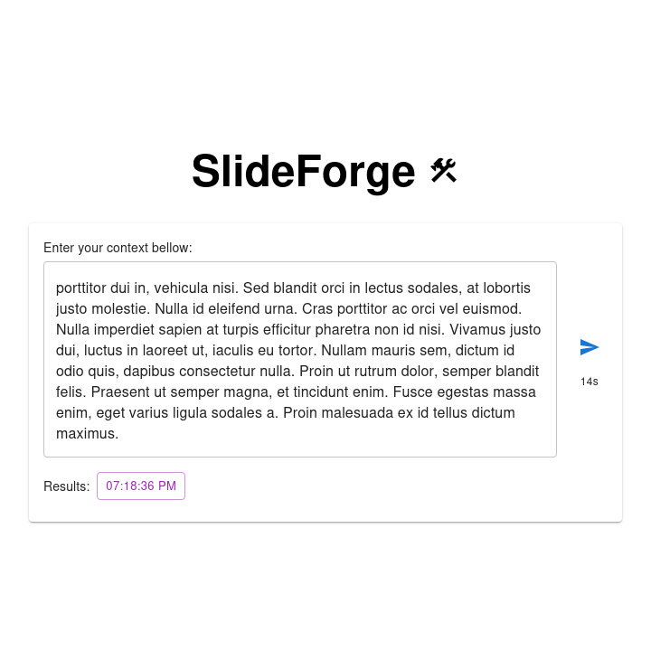
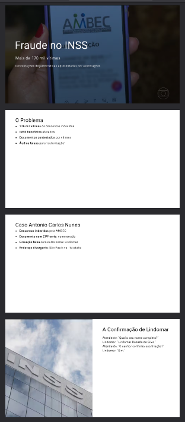

# SlideForge

 

A full-stack service for generating professional presentation slides (PDF) from plain text input. The project consists of a backend HTTP API and a frontend web app for easy interaction.

---

## Project Structure

- [backend/](backend/README.md) — Node.js/TypeScript service that generates slides using AI and Slidev.
- [frontend/](frontend/README.md) — React + Material UI web app for sending context and downloading generated PDFs.

---

See each subproject's README for setup, usage, and implementation details.

## Demo

 

## License

MIT
