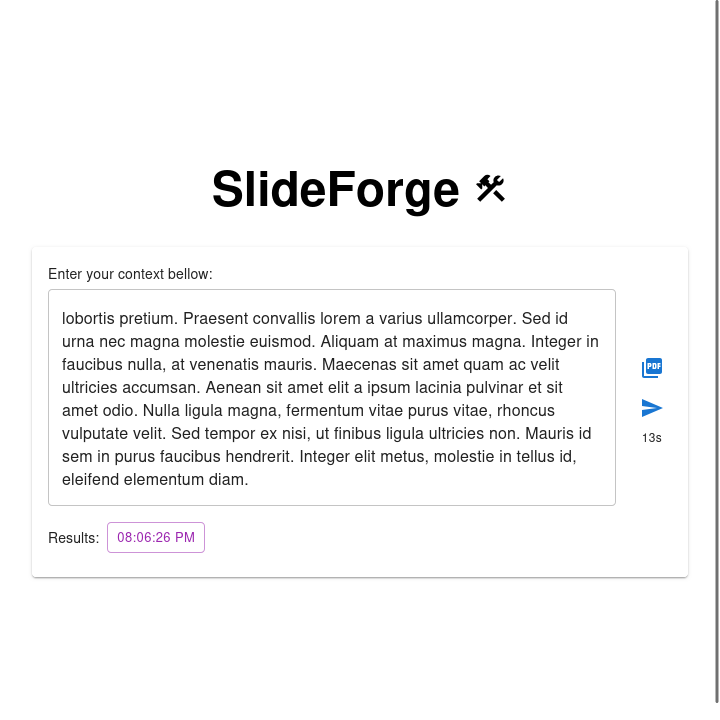

# SlideForge

 

A full-stack service for generating professional presentation slides (PDF) from plain text input.

## Project Structure

- [backend/](backend/README.md): [Hono](https://hono.dev/) + TypeScript service that generates slides using [Gemini](https://ai.google.dev/) and [Slidev](https://sli.dev/).
- [frontend/](frontend/README.md): React + [Material UI](https://mui.com/material-ui/) web app for sending context and downloading generated PDFs.

## Demo

